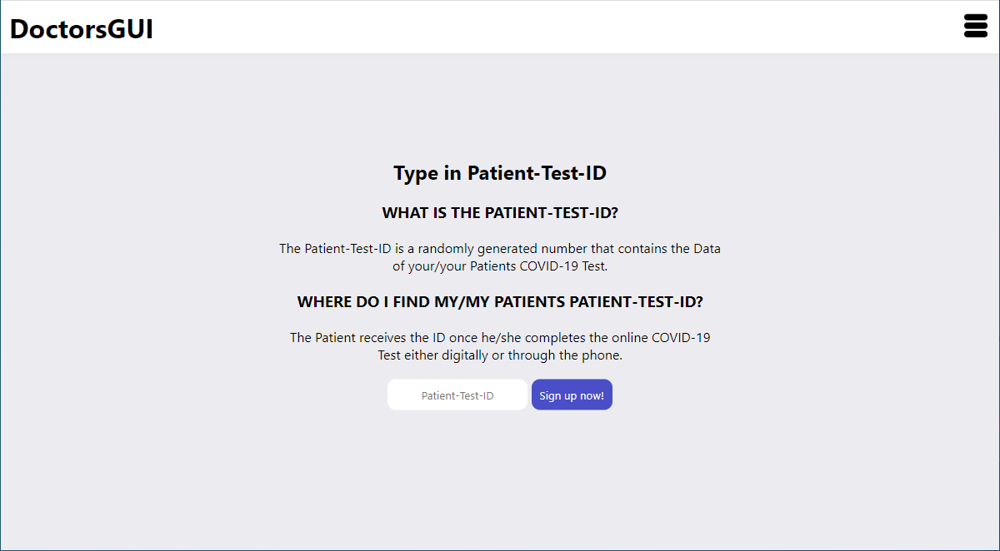
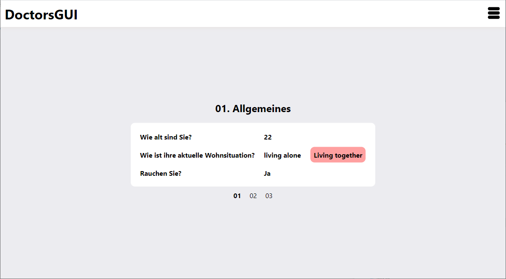

## Description




### Unsers Idee
Barrierefrei Variation, aufbauend auf dem Fragenkatalog der Charite, die aufgrund der angegeben Symtome eine Einschätzung bekommen, ob der Arztbesuch sinnvoll ist. Die erhaltene ID ermöglicht dann dem Arzt, die eingetragenen Symtome direkt online abzurufen.

## Dependencies

* [NestJS] - nodejs framework
* [HTML2PDF] - PDF export

[NestJS]: <https://nestjs.com/>
[HTML2PDF]: <https://github.com/eKoopmans/html2pdf.js>

## Installation

```bash
$ npm install
```

## Running the app

```bash
$ npm run start
```